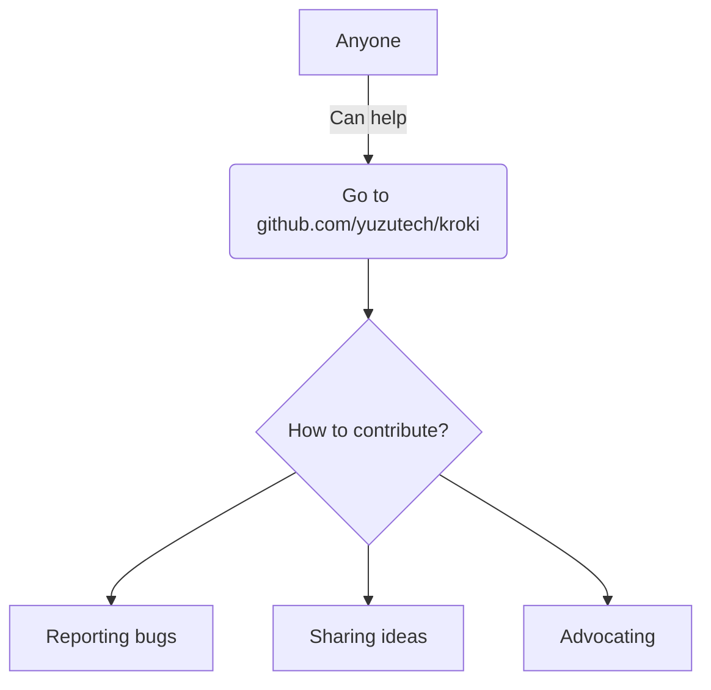

# T&iacute;tulo (IGNORADO)

Texto

## Descripción del proyecto:

Se realizará la automatización de la inspección visual de elementos externos en el RTM 

Estos elementos son inspeccionados bajo la norma: [NTC5375](https://bogota.gov.co/sites/default/files/tys/2017/11/ntc-5375.pdf)


Ejemplo de lista:

- item 1
- item 2

Ejemplo de lista numerada:

1. Uno
2. Dos
3. Tres

Ejemplo de código:

```
git clone https://github.com/structurizr/lite.git structurizr-lite
git clone https://github.com/structurizr/ui.git structurizr-ui
cd structurizr-lite
./ui.sh
./gradlew build
```

Ejemplo de Diagrama 2:


Ejemplo de imágen externa:


Ejemplo de imágen interna:


## Mermaid code example

Ejemplo file de Mermaid:



## Mermaid example desde C4:

Ejemplo Mermaid desde C4:

