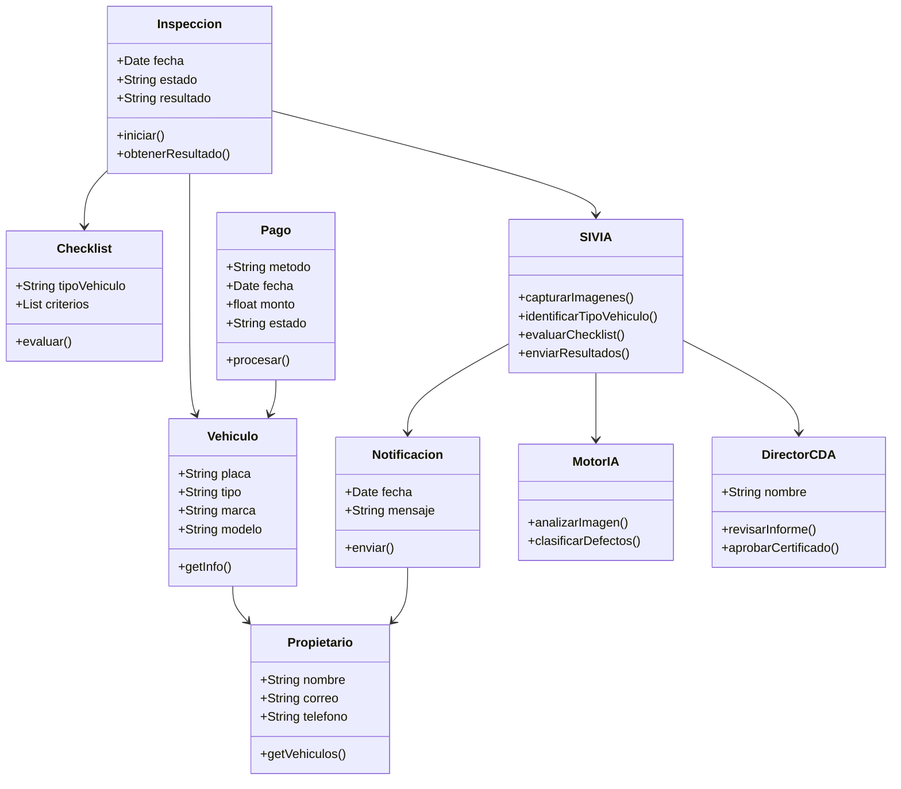
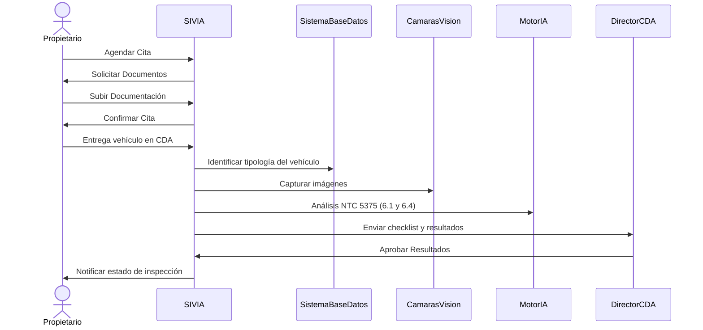

# Automatización Revisión Técnico-Mecánica (RTM)

El proyecto busca **automatizar la inspección visual de los vehículos** en el proceso de Revisión Técnico-Mecánica (RTM) en los CDA, reduciendo la subjetividad, aumentando la trazabilidad y mejorando la eficiencia operativa. La solución prioriza los numerales **6.1 (Revisión exterior)** y **6.4 (Alumbrado y señalización)** de la **NTC 5375**, integrando analítica de imágenes, reglas normativas y notificaciones en tiempo real.

---

## Descripción del proyecto

Se realizará la **automatización de la inspección visual de elementos externos** en el RTM mediante el **SIVIA (Sistema de Inspección Visual Automatizado por IA)**. El sistema:
- Recibe citas y pagos en línea, validando **SOAT** y datos básicos.
- Captura imágenes del vehículo, identifica **tipología** y aplica los **checklists** correspondientes según la **NTC 5375**.
- Clasifica defectos exteriores y de alumbrado/señalización con un **Motor de IA**.
- Genera resultados con **criterios de aceptación normativos**, enviando reportes al **Director del CDA** y notificaciones al **Propietario**.
- Emite reportes con **trazabilidad** y **auditorías automatizadas** para reguladores.

Estos elementos son inspeccionados bajo la norma: [NTC5375](https://bogota.gov.co/sites/default/files/tys/2017/11/ntc-5375.pdf)

---

## Contexto y problema

Actualmente, el proceso de revisión se realiza de manera manual, generando:  
- Filas largas por atención en orden de llegada.  
- Pagos presenciales en efectivo y manejo de comprobantes físicos.  
- Dependencia de la inspección **visual/sensorial** del operario.  
- **Subjetividad y variabilidad** en los resultados.  
- Baja trazabilidad y oportunidades de **fraude** (ausencia de auditorías digitales).  

**Dolores clave:** tiempos elevados, resultados inconsistentes, poca transparencia para el usuario y carga administrativa para el CDA.

---

## Objetivos de negocio (ON)

1. **ON-1**: Reducir en **99%** el tiempo promedio de revisión mediante procesos automatizados (12 meses).  
2. **ON-2**: Disminuir la variabilidad de inspecciones en **80%**, mitigando sesgos subjetivos con diagnóstico automatizado (12 meses).  
3. **ON-3**: Implementar un sistema **digital con IA** que sustituya el proceso manual en al menos el **90%** de las revisiones.  
4. **ON-4**: Aumentar en **90%** la **trazabilidad y transparencia** del proceso con auditorías y reportes digitales (6 meses).  

---

## Criterios de éxito (CE)

- **CE-1**: Aprobación del flujo automatizado por **reguladores** (RUNT/Dirección de Tránsito).  
- **CE-2**: Reducción demostrable del **tiempo total de inspección** respecto a la línea base.  
- **CE-3**: Disminución significativa de la **variabilidad inter-operario** en hallazgos.  
- **CE-4**: **Disponibilidad** ≥ 99% del módulo de inspección y notificaciones en ventana operativa.  
- **CE-5**: **Trazabilidad** completa (evidencia multimedia, hash de registros, bitácoras de auditoría).  

---

## Actores y necesidades

- **Propietario del vehículo**: agendar, pagar, recibir notificaciones y resultados claros.  
- **Operario/Inspector**: supervisar el proceso automatizado y validar hallazgos críticos.  
- **Director del CDA**: revisar informes y **aprobar/rechazar** emisión de certificado RTM.  
- **Reguladores (RUNT / Dirección de Tránsito)**: recibir reportes oficiales estructurados y auditables.  

---

## Alcance, limitaciones y exclusiones

- **Alcance**: inspección de **numerales 6.1 y 6.4** con evaluación de **defectos externos**.  
- **LI-1**: La revisión de alumbrado/señalización (**6.4**) se limita a **defectos externos**.  
- **EX-1**: Se excluyen revisiones fuera de **6.1** y **6.4**, así como pruebas mecánicas internas.  

---

## Requerimientos funcionales (RF)

- **RF-1**: **Agendamiento online** con pagos en línea y validación automática de **SOAT**.  
- **RF-2**: **SIVIA** para revisión exterior y alumbrado, con calificación según **NTC 5375**.  
- **RF-3**: **Identificación de tipología de vehículo** y selección dinámica del **checklist**.  
- **RF-4**: **Tracking en tiempo real** y **notificaciones** de estado al propietario.  
- **RF-5**: **Reportes y auditoría** con evidencias (imágenes), sellos de tiempo y exportación para reguladores.  

---

## Historias de usuario (ejemplos)

- **Como Propietario**, quiero **agendar y pagar en línea** para evitar filas y manejar todo desde mi móvil.  
- **Como Inspector**, quiero **visualizar los hallazgos del Motor IA** para validar rápidamente los resultados.  
- **Como Director del CDA**, quiero **recibir un informe consolidado** con criterios NTC para decidir sobre el certificado.  
- **Como Regulador**, quiero **reportes estructurados y auditables** para supervisión y trazabilidad.  

---

## Criterios de aceptación (muestra)

- Si el SOAT está **vigente**, el sistema permite **confirmar la cita**; si no, **rechaza** y notifica.  
- Para un vehículo de tipo **motocicleta**, SIVIA aplica **checklist** correspondiente y registra evidencias.  
- Cada hallazgo genera **evidencia** (imagen), **clasificación** (defecto menor/mayor), **timestamp** y **usuario responsable**.  
- Las **notificaciones** reflejan el estado: *en inspección*, *hallazgos detectados*, *aprobado/rechazado*, *reporte disponible*.  

---

## Ejemplos de listas

- Integración con cámaras de visión.  
- Persistencia en base de datos con trazabilidad.  
- Panel para director y reguladores.  

**Lista numerada:**  
1. Captura de imágenes.  
2. Análisis por IA (6.1, 6.4).  
3. Generación de reporte y notificaciones.  

---

## Ejemplo de código

```bash
git clone https://github.com/structurizr/lite.git structurizr-lite
git clone https://github.com/structurizr/ui.git structurizr-ui
cd structurizr-lite
./ui.sh
./gradlew build
```

---

## Ejemplo de Diagrama (referencia)


---

## Diagrama de Clases: Automatización CDA (Mermaid)



---

## Diagrama de Secuencia (Kroki / seqdiag)

> Útil para Documentos/Confluence que integren **Kroki**. Si tu entorno de Structurizr Docs tiene soporte Kroki habilitado, este bloque se renderiza automáticamente.

```kroki-seqdiag
seqdiag {
  activation = none;

  Propietario;
  SIVIA;
  SistemaBaseDatos;
  CamarasVision;
  MotorIA;
  DirectorCDA;

  Propietario -> SIVIA [label = "Agendar Cita"];
  SIVIA -> Propietario [label = "Solicitar Documentos"];
  Propietario -> SIVIA [label = "Subir Documentación"];
  SIVIA -> Propietario [label = "Confirmar Cita"];
  Propietario -> SIVIA [label = "Entrega vehículo en CDA"];
  SIVIA -> SistemaBaseDatos [label = "Identificar tipología del vehículo"];
  SIVIA -> CamarasVision [label = "Capturar imágenes"];
  SIVIA -> MotorIA [label = "Análisis NTC 5375 (6.1 y 6.4)"];
  SIVIA -> DirectorCDA [label = "Enviar checklist y resultados"];
  DirectorCDA -> SIVIA [label = "Aprobar Resultados"];
  SIVIA -> Propietario [label = "Notificaciones estado de inspección"];
}
```

> Si tu visor **no** reconoce `kroki-seqdiag`, conserva el mismo contenido con el fence genérico `seqdiag`:

```seqdiag
seqdiag {
  activation = none;

  Propietario;
  SIVIA;
  SistemaBaseDatos;
  CamarasVision;
  MotorIA;
  DirectorCDA;

  Propietario -> SIVIA [label = "Agendar Cita"];
  SIVIA -> Propietario [label = "Solicitar Documentos"];
  Propietario -> SIVIA [label = "Subir Documentación"];
  SIVIA -> Propietario [label = "Confirmar Cita"];
  Propietario -> SIVIA [label = "Entrega vehículo en CDA"];
  SIVIA -> SistemaBaseDatos [label = "Identificar tipología del vehículo"];
  SIVIA -> CamarasVision [label = "Capturar imágenes"];
  SIVIA -> MotorIA [label = "Análisis NTC 5375 (6.1 y 6.4)"];
  SIVIA -> DirectorCDA [label = "Enviar checklist y resultados"];
  DirectorCDA -> SIVIA [label = "Aprobar Resultados"];
  SIVIA -> Propietario [label = "Notificaciones estado de inspección"];
}
```

---

## Diagrama de Secuencia (Mermaid)



---

## Mermaid example desde C4 (referencia)


---

## Consideraciones de calidad y seguridad (resumen)

- **Disponibilidad y resiliencia**: colas de eventos, reintentos, almacenamiento de evidencias con redundancia.  
- **Seguridad**: autenticación multifactor para roles críticos, cifrado en tránsito/repouso, control de acceso basado en roles.  
- **Trazabilidad**: bitácoras firmadas, hashes de evidencia, sellos de tiempo confiables.  
- **Privacidad**: minimización de datos personales y retención acorde a regulación.  
- **Escalabilidad**: procesamiento paralelo de inspecciones y análisis por lotes en horas pico.  

