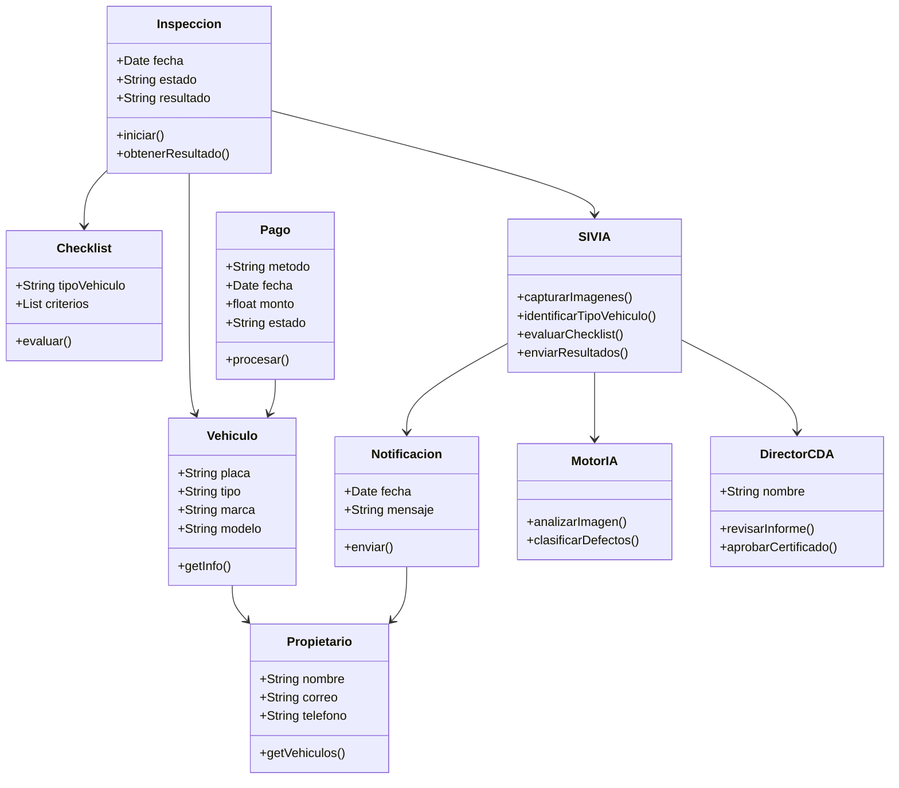
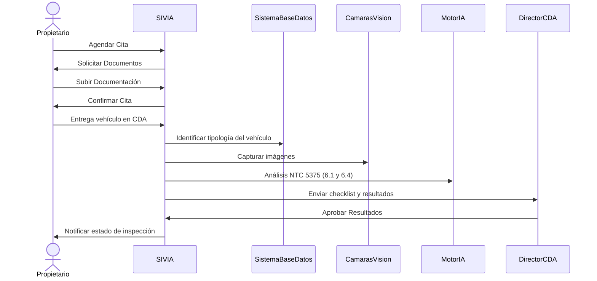

# Proyecto: Automatización de la Revisión Técnico‑Mecánica (RTM) en CDA


- **Estado:** Inicial
- **Versión del documento:** 1.0
- **Fecha:** 22/08/2025
- **Equipo proponente:** Elian Gil - Cristian Valencia

---

## Resumen Ejecutivo

La automatización de la revisión técnico‑mecánica (RTM) busca **reducir tiempos, sesgos y costos** mejorando la **trazabilidad** y **transparencia** del proceso. La solución propuesta integra:

1. **Agendamiento y pagos en línea** con validación previa de requisitos (p. ej., SOAT vigente).
2. **SIVIA** (Sistema de Inspección Visual Automatizado por IA) que apoya la inspección exterior (NTC 5375 **6.1**) y alumbrado/señalización (**6.4**).
3. **Plataforma de orquestación y reportes** para el Director del CDA con auditorías y emisión digital de certificados (según decisión del director).

**Impacto esperado (metas clave):**

* **ON‑1:** Reducir en **99%** el tiempo promedio de RTM (aspiracional; se operacionaliza por fases).
* **ON‑2:** Disminuir **80%** la variabilidad de resultados (estandarización + apoyo IA + reglas).
* **ON‑3:** Sustituir **90%** del registro manual por un **sistema digital con IA**.
* **ON‑4:** Aumentar **90%** la trazabilidad y transparencia mediante **auditorías automatizadas** y **reportes digitales**.

---

## Alcance, Límites y Exclusiones

**En alcance**

* Inspección **exterior** y **alumbrado/señalización** según **NTC 5375** (numerales 6.1 y 6.4).
* Agendamiento web, pagos en línea, validación **SOAT** y documentación básica.
* Captura de evidencias (imágenes/video), clasificación y calificación asistida por IA.
* Reportes digitales, tablero para Dirección CDA, notificaciones al propietario.
* Integración con sistemas internos del CDA y con servicios externos necesarios (p. ej., validación SOAT, pasarela de pagos, RUNT\* según viabilidad contractual y técnica).

**Límites / Exclusiones**

* **LI‑1:** Alumbrado y señalización se limita a **defectos externos**.
* **EX‑1:** Se excluyen revisiones fuera de NTC 5375 **6.1** y **6.4**.
* No se automatiza la determinación final del certificado; **el Director CDA decide** sobre la emisión con base en el reporte.

**Suposiciones**

* Disponibilidad de conectividad confiable en el CDA.
* Política de obtención y almacenamiento de evidencias acorde a privacidad.
* Pasarela de pagos con conciliación y reintentos.

---

## Marco Normativo y Cumplimiento (alto nivel)

* **NTC 5375** (referente técnico para inspección exterior y alumbrado/señalización).
* **RUNT / Autoridades de Tránsito** (interoperabilidad cuando aplique).
* **Protección de Datos** (Habeas Data / Ley de datos personales): consentimiento, minimización, retención y anonimización/pseudonimización de evidencias.
* **Seguridad**: Gestión de identidades, cifrado en tránsito y en reposo, registros de auditoría, controles de acceso con mínima privilegio.

> Nota: Se elaborará una **matriz de trazabilidad regulatoria** que mapea requisitos normativos ⇄ procesos ⇄ controles técnicos.

**Referencia normativa clave:** NTC 5375 (énfasis en **6.1 Revisión exterior** y **6.4 Alumbrado y señalización**). Consulta: [https://bogota.gov.co/sites/default/files/tys/2017/11/ntc-5375.pdf](https://bogota.gov.co/sites/default/files/tys/2017/11/ntc-5375.pdf)

---

## Objetivos de Negocio y Criterios de Éxito

**Objetivos (aportados por el cliente)**: ON‑1, ON‑2, ON‑3, ON‑4.
**Criterios de Éxito propuestos**

* **CE‑1:** Tiempo medio desde check‑in a resultado ≤ *X* min (definir línea base actual y meta por fase).
* **CE‑2:** **≥95%** de inspecciones con evidencia digital completa y sellos de auditoría.
* **CE‑3:** Disminución ≥**80%** de discrepancias inter‑operario para mismos defectos (pruebas ciegas).
* **CE‑4:** Disponibilidad del servicio **≥99.5%** mensual (Web + API).
* **CE‑5:** SLA de notificaciones ≤ **30 s** desde evento de avance.
* **CE‑6:** Tiempo medio de emisión de reporte ≤ **2 min** post‑inspección.
* **CE‑7:** Satisfacción del usuario final (CSAT) ≥ **4.5/5**.

---

## Actores y Stakeholders

**Directos**: Propietario del vehículo, Técnico del CDA, Director del CDA.
**Indirectos**: Área de Caja/Finanzas CDA, Soporte/Operaciones IT, Proveedor Pasarela de Pagos.
**Reguladores**: RUNT, Autoridad de Tránsito competente.

**Personas (resumen)**

* **Propietario**: necesita rapidez, claridad, notificaciones y trazabilidad.
* **Técnico**: requiere guía estandarizada, checklist y captura de evidencias sin fricción.
* **Director**: necesita reportes, auditoría, indicadores y decisión informada.

---

## Casos de Uso (principales)

1. **CU‑01 Agendar cita y pagar en línea**
   **Disparador:** Usuario ingresa a la Web.
   **Precondiciones:** SOAT vigente y documentación mínima.
   **Flujo principal:** Registro → Selección franja → Pago → Confirmación.
   **Postcondiciones:** Cita confirmada, token de seguimiento, órdenes generadas.
   **Reglas:** Validación automática de SOAT; manejo de reintentos de pago.

2. **CU‑02 Check‑in en CDA y entrega del vehículo**
   Escaneo de QR → Validación de cita → Colocación en cola inteligente.

3. **CU‑03 Inspección asistida por SIVIA (6.1 y 6.4)**
   Captura de evidencias → IA detecta/etiqueta → Reglas NTC → Pre‑calificación.
   Notificaciones de progreso al propietario (tracking).

4. **CU‑04 Generación de reporte y decisión**
   Consolidación de hallazgos → Puntajes / cumplimiento → Envío a Director.
   Director **aprueba o rechaza** certificado → Notificación y entrega digital.

5. **CU‑05 Auditoría y trazabilidad**
   Línea de tiempo por inspección, bitácora firmada, hash de evidencias y exportación.

**Flujos alternos (ejemplos):** pago fallido; SOAT no vigente; evidencia incompleta; IA con baja confianza (derivación a revisión manual); rechazo de certificado.

---

## Requerimientos Funcionales (RF)

**(Aportados + ampliados y priorizados)**

* **RF‑01 (Debe):** Agendamiento online con validación previa de **SOAT**.
* **RF‑02 (Debe):** Pagos en línea con conciliación y reintentos.
* **RF‑03 (Debe):** **SIVIA** identifica tipología del vehículo y aplica formulario/checklist correspondiente.
* **RF‑04 (Debe):** **SIVIA** realiza inspección visual automatizada y califica defectos conforme **NTC 5375 (6.1 y 6.4)**.
* **RF‑05 (Debe):** **Tracking** en tiempo real del estado de inspección.
* **RF‑06 (Debe):** Notificaciones al propietario (web/push/email/SMS) con eventos clave.
* **RF‑07 (Debe):** Tablero del **Director** con reportes, evidencias y decisión de certificado.
* **RF‑08 (Debe):** Gestión de usuarios, roles y permisos (Propietario/Técnico/Director/Operaciones).
* **RF‑09 (Debe):** Bitácora/auditoría de acciones y sellos de tiempo.
* **RF‑10 (Debe):** Exportación de reportes (PDF/JSON) y API para interoperabilidad.
* **RF‑11 (Debe):** Almacenamiento seguro de evidencias (imágenes/video) con metadatos.
* **RF‑12 (Debe):** Reglas de **derivación a revisión manual** cuando la confianza IA sea baja.
* **RF‑13 (Debe):** Módulo de **calibración** periódica de IA y actualización de umbrales.
* **RF‑14 (Debe):** Integración con **RUNT** / Autoridad (si procede) y pasarela de pagos.
* **RF‑15 (Debe):** Gestión de citas en cola con **priorización inteligente** (p. ej., por capacidad de línea, tipo de vehículo, SLA, puntualidad).
* **RF‑16 (Debería):** Firma electrónica del reporte y sellado de tiempo.
* **RF‑17 (Podría):** Módulo de analítica (indicadores por horario, tipo de vehículo, defectos recurrentes).

---

## Requerimientos No Funcionales (RNF)

* **Disponibilidad:** ≥ **99.5%** mensual (Web, API, notificaciones).
* **Escalabilidad:** horizontal (k8s/EKS), CDN para frontend, colas para picos.
* **Rendimiento:** latencia **P95** de API < **300 ms** (consultas estándar); reporte ≤ **2 min**.
* **Seguridad:** Autenticación OIDC/OAuth2; MFA para Director; cifrado **TLS 1.2+**; datos en reposo AES‑256; WAF; gestión de secretos.
* **Privacidad:** Retención mínima necesaria; ofuscación de datos personales en logs; control de acceso por rol.
* **Trazabilidad:** correlación por **ID de inspección**; hash de evidencias; auditoría inmutable.
* **Observabilidad:** métricas, logs estructurados, trazas distribuidas (OpenTelemetry).
* **Mantenibilidad:** cobertura de pruebas ≥ **80%**; contract‑testing; documentación viva.
* **Resiliencia:** DR RPO ≤ **15 min** / RTO ≤ **60 min**; backups automáticos.

---

## Arquitectura de Solución (alto nivel)

**Tecnologías (propuestas alineadas al diagrama):**

* **Frontend Web:** React (entregado por **CloudFront**).  
* **API Gateway (AWS):** enrutamiento seguro.  
* **Load Balancer (ALB/NLB):** balanceo a microservicios.  
* **Backends (API 1..3):** Node.js + Express en **EKS** (Kubernetes).  
* **Base de Datos:** PostgreSQL (p. ej., **Amazon RDS**).  
* **SIVIA (IA):** servicio Python (p. ej., en **EKS**/**SageMaker**) con endpoint REST.  
* **Almacenamiento de evidencias:** Amazon **S3** con políticas de ciclo de vida.  
* **Mensajería/Eventos:** **SQS/SNS** para desacoplar notificaciones y trabajos IA.  
* **Autenticación/Identidades:** **Cognito** (ciudadano) + IAM/RBAC (equipo CDA).  
* **Observabilidad:** **CloudWatch** + OpenTelemetry/Prometheus + Grafana.  
* **Seguridad:** **AWS WAF**, **Secrets Manager**, **KMS**.  

---

### Diagramas de Arquitectura

*   
  *Descripción:* Representa actores (Propietario, Técnico, Director) y cómo se relacionan con la plataforma central SIVIA.

*   
  *Descripción:* Muestra los principales contenedores: Frontend, API Gateway, Load Balancer, APIs en EKS, DB y SIVIA.

*   
  *Descripción:* Detalle de los componentes de la aplicación web (Cliente, Técnico, Director y Cliente API).

*   
  *Descripción:* Detalle de la API de Negocio (controladores de citas/inspección, servicio de validación, cliente SIVIA, repositorio).

---

### Componentes Complementarios Recomendados

* **Servicio de Firma y Sellado de Tiempo**, **Motor de Reglas** (NTC), **Servicio de Plantillas PDF**, **Servicio de Notificaciones** (email/SMS/push), **Servicio de Auditoría Inmutable** (p. ej., tablas append-only / ledger).  

---

### Topología de Red

* **VPC** con subredes públicas/privadas, **Security Groups** por rol, **NAT** para salidas controladas, endpoints VPC para S3/RDS.  
* Restricción de acceso a **DB** solo desde pods autorizados.  

---

### Componentes del Frontend

* **Vista Cliente (React):** gestión de citas, pagos y seguimiento en tiempo real.  
* **Vista Técnico (React):** cola de vehículos y monitoreo de inspección con estados y evidencias.  
* **Vista Director (React):** reportes consolidados, criterios NTC, decisión de certificado y exportaciones.  
* **Cliente API (Axios):** encapsula la comunicación HTTPS con el backend.  

---

### Componentes del Backend

* **Controlador de Citas (Express):** agendamiento, validación de SOAT y pagos.  
* **Controlador de Inspección (Express):** orquesta captura → IA → reglas NTC → reporte.  
* **Servicio de Validación:** integración con RUNT/autoridades para documentos (p. ej., SOAT).  
* **Cliente SIVIA (HTTP):** gestiona invocaciones al servicio de IA.  
* **Repositorio de Datos (ORM p. ej., Sequelize/Prisma):** persistencia en PostgreSQL (RDS).  

---

### Alternativas de Módulo IA y Nube

La solución base usa **Python en EKS/SageMaker (AWS)**. Alternativamente, se puede emplear **Google Cloud Vision AI / Vertex AI** para el procesamiento de imágenes, manteniendo interoperabilidad vía API. Esta estrategia **multi-nube** permite evaluar costo/rendimiento y disponibilidad según región y acuerdos.  


## Modelo de Datos (lógico)

Entidades clave y relaciones (resumen):

* **Vehiculo** (placa, tipo, marca, modelo, año, VIN opcional).
* **Propietario** (identificación, nombre, correo, teléfono, consentimientos).
* **Inspeccion** (fecha, estado, resultado, puntaje, umbrales, **id\_cita**).
* **Checklist** (tipoVehiculo, criterios, resultado por criterio, evidencias vinculadas).
* **Pago** (método, fecha, monto, estado, referencia pasarela).
* **Notificacion** (fecha, canal, mensaje, estado de entrega).
* **SIVIA/ResultadoIA** (modelo, versión, confianza, etiquetas/defectos, anexos).
* **Usuario/Rol** (permisos granulares).
* **Certificado** (estado, firma, hash, sellado).

> Se adjuntará diagrama ER detallado en anexo técnico.

---

## APIs Principales

**Autenticación**
`POST /auth/login` (propietario) | `POST /auth/refresh`

**Citas/Pagos**
`POST /citas` (crea cita)
`GET /citas/{id}` (detalle + tracking)
`POST /pagos/checkout` (init)
`POST /pagos/webhook` (confirmación)

**Inspecciones**
`POST /inspecciones` (iniciar)
`POST /inspecciones/{id}/evidencias` (subir imagen/video + metadatos)
`GET /inspecciones/{id}/resultado`

**SIVIA**
`POST /sivia/analizar` (input: evidencias y contexto; output: etiquetas/defectos + confianza)
`GET /sivia/modelos` (versionado)

**Reportes/Certificados**
`GET /reportes/{inspeccionId}` (PDF/JSON)
`POST /certificados/{inspeccionId}/aprobar|rechazar` (Director)

**Auditoría**
`GET /auditoria/{inspeccionId}` (línea de tiempo, firmas, hash).

> Todos los endpoints requieren **trazabilidad** por `x-correlation-id` y **scopes** por rol.

---

## Diseño de SIVIA (IA)

**Objetivo:** asistir la inspección de **NTC 5375 (6.1 y 6.4)** mediante visión por computador y reglas, reduciendo subjetividad y tiempos.

**Pipeline**

1. **Captura**: Cámaras fijas en bahía/estación y/o móviles controladas por técnico.
2. **Pre‑proceso**: normalización, reducción de ruido, ajuste de iluminación.
3. **Detección/Segmentación**: modelo de detección de objetos/defectos (p. ej., familia YOLO/Mask R‑CNN) entrenado por tipología.
4. **Clasificación/Scoring**: severidad por criterio, **confianza**, umbrales y **reglas NTC**.
5. **Explicabilidad**: mapas de calor/grad‑CAM, resumen de evidencias.
6. **Salida**: estructura por checklist, lista de hallazgos y recomendaciones.

**Métricas de desempeño**

* **Precisión/Exhaustividad** por criterio, **mAP** en validación; tasa de **falsos negativos** crítica.
* **Tiempos**: inferencia por imagen < **300 ms** (aceleración GPU opcional).
* **Confianza mínima** configurable; **derivación** a revisión manual si < umbral.

**MLOps**

* **Dataset** versionado, consentimiento y anonimización.
* **Etiquetado** con guía basada en NTC; control de calidad inter‑anotador.
* **Registro de experimentos** (MLflow), **registro de modelos** y **canary**/A‑B.
* **Monitoreo** de drift y re‑entrenos programados.

**Riesgos IA**

* Sesgo por condiciones de iluminación o diversidad de vehículos. **Mitigación:** dataset balanceado, pruebas en campo, sensores auxiliares.
* Sobre‑confianza del operario. **Mitigación:** UI destaca **nivel de confianza** y exige revisión manual en casos límite.

---

## Procesos y Secuencias

* **\[COLOCA AQUÍ IMG: Diagrama de Actividades/Swimlanes – actdiag]**
  *Descripción:* Flujo de propietario → SIVIA → Director con validaciones y notificaciones.

* **\[COLOCA AQUÍ IMG: Diagrama de Secuencia – Mermaid]**
  *Descripción:* Eventos 1..11a/11b con ramas de aprobación o rechazo.

* **\[COLOCA AQUÍ IMG: Diagrama de Secuencia (Integración) – seqdiag]**
  *Descripción:* Interacciones Propietario, SIVIA, Base de Datos, Cámaras, Motor IA, Director.

---

## Modelo de Dominio (UML)

* **\[COLOCA AQUÍ IMG: Diagrama de Clases – Mermaid]**
  *Descripción:* Entidades `Vehiculo`, `Propietario`, `Inspeccion`, `Checklist`, `Pago`, `Notificacion`, `SIVIA`, `MotorIA`, `DirectorCDA` y relaciones.

---

## Seguridad, Privacidad y Cumplimiento

* **Identidades y Accesos:** OIDC/OAuth2, MFA para perfiles críticos (Director/Operaciones).
* **Cifrado:** TLS 1.2+ en tránsito; KMS/AES‑256 en reposo (DB, S3).
* **Secretos:** AWS Secrets Manager; rotación periódica.
* **Logs/Auditoría:** inmutables, con hash por lote de evidencias; retención regulada.
* **Protección de Datos:** consentimiento informado, políticas de retención mínima, anonimización de placas cuando no sean necesarias post‑proceso.
* **WAF y Anti‑fraude:** reglas OWASP, rate limiting, validación de contenidos en carga.

---

## Operación, Observabilidad y DR

* **Monitoreo:** métricas de infraestructura (CPU, RAM, EKS), métricas de negocio (tiempos de RTM, cola, conversión de pagos), métricas de IA (confianza media, drift).
* **Alertas:** umbrales en SLIs/SLOs (latencia, tasa de errores, disponibilidad).
* **Backups:** RDS diarios; S3 con versionado y políticas de ciclo de vida.
* **DR:** multi‑AZ; pruebas semestrales de recuperación.

---

## DevSecOps y Calidad

* **Repositorio monorepo o polyrepo** con convenciones; **CI/CD** (GitHub Actions/GitLab CI).
* **SAST/DAST/Dependabot**; análisis de contenedores; políticas de firma de imágenes.
* **Infraestructura como Código:** Terraform/CloudFormation.
* **Pruebas:** unitarias, contract‑testing (PACT), e2e (Playwright/Cypress), pruebas de carga (k6), pruebas de seguridad (OWASP ZAP).
* **Release Management:** versionado semántico; feature flags; **canary**.

---

## Plan de Pruebas y Validación de Campo

* **Piloto** en 1 línea de inspección con tipos de vehículo representativos.
* **UAT** con técnicos y Director; checklist de aceptación por criterio NTC.
* **Medición comparativa** contra proceso actual (tiempos, variabilidad, satisfacción).
* **Reporte de resultados** y plan de escalado progresivo.

---

## Roadmap y Entregables (12 meses sugeridos)

**Fase 0 (2–4 sem):** Descubrimiento, línea base, acuerdos regulatorios, diseño detallado.
**Fase 1 (8–10 sem):** MVP (CU‑01 a CU‑04, IA básica para 6.1).
**Fase 2 (8–10 sem):** Extensión a 6.4, tablero Director, auditoría avanzada.
**Fase 3 (8–10 sem):** Optimización, analítica, firma/sello, integraciones externas.
**Go‑Live escalonado** por líneas de inspección.

**Entregables:**

* Documento de arquitectura y seguridad (este).
* Contratos de API + catálogos de eventos.
* Guías operativas, de soporte y DR.
* Dataset y guía de etiquetado.
* Manuales de usuario (Propietario/Técnico/Director).

---

## Riesgos y Mitigaciones

* **R1:** Objetivo **ON‑1 (99%)** es ambicioso. → **Mitigación:** metas por fases (30% → 60% → 80% → optimización).
* **R2:** Variabilidad de entornos (iluminación, clima). → Controles de captura y calibración IA.
* **R3:** Interoperabilidad con externos (RUNT/pagos). → Entornos sandbox, colas y reintentos idempotentes.
* **R4:** Privacidad de evidencias. → Anonimización y retención mínima.
* **R5:** Adopción por el personal. → Capacitación y **Human‑in‑the‑loop** claro.

---

## KPIs y Métricas Operativas

* Tiempo total RTM, tiempo por etapa, % reintentos de pago, % inspecciones derivadas a manual, distribución de severidades, mAP del modelo, tasa de falsos negativos, CSAT, disponibilidad, MTTR.

---

## Plan de Adopción y Capacitación

* Talleres a técnicos (uso de cámaras, captura correcta, interpretación de confianza IA).
* Guía del Director (lectura de reportes, criterios de aceptación).
* Comunicación al ciudadano (proceso, tiempos, privacidad, descargas de certificados).

---

## Backlog Inicial (Dudas y Pendientes)

* Validar **fuentes de datos** y cámaras disponibles en la línea.
* Definir **metas por fase** para ON‑1 y CE‑1 (línea base actual requerida).
* Confirmar **pasarela de pagos** y flujos de conciliación.
* Aclarar **interoperabilidad** con RUNT/Autoridad (contratos, alcance real).
* Política de **retención** y **anonimización** de evidencias.
* Definir **criterios de aceptación** por cada ítem del checklist 6.1/6.4 (tablas maestras).

---

## Anexos (imágenes y artefactos)

* **\[COLOCA AQUÍ IMG: Diagrama de Contexto – Structurizr]**
* **\[COLOCA AQUÍ IMG: Diagrama de Contenedores – Structurizr]**
* **\[COLOCA AQUÍ IMG: Diagrama de Actividades/Swimlanes – actdiag]**
* **\[COLOCA AQUÍ IMG: Diagrama de Secuencia – Mermaid]**
* **\[COLOCA AQUÍ IMG: Diagrama de Clases – Mermaid]**
* **\[COLOCA AQUÍ IMG: Diagrama de Secuencia (Integración) – seqdiag]**

---

## Matriz de Trazabilidad (extracto)

| Requisito | Caso de Uso | Componente                         | Evidencia                                 | Criterio de Aceptación                          |
| --------- | ----------- | ---------------------------------- | ----------------------------------------- | ----------------------------------------------- |
| RF‑01     | CU‑01       | Web/Agendamiento, API Citas, Pagos | Log de validación SOAT, recibo            | Cita confirmada si SOAT vigente y pago aprobado |
| RF‑03     | CU‑03       | SIVIA, API Inspecciones            | Registro de tipología, checklist aplicado | Tipología correcta ≥ 98%                        |
| RF‑04     | CU‑03/04    | SIVIA, Motor de Reglas             | Reporte con defectos y severidad          | mAP ≥ umbral; reglas NTC aplicadas              |
| RF‑07     | CU‑04       | Panel Director                     | Decisión registrada y firmada             | Certificado emitido/rechazado                   |
| RF‑09     | Todos       | Auditoría                          | Línea de tiempo completa                  | 100% eventos críticos trazables                 |

---

## Historias de Usuario (ejemplos con criterios Gherkin)

**HU‑01** Como *Propietario* quiero agendar y pagar mi RTM para no hacer filas.
**Criterios (Gherkin):**

```
Dado que tengo SOAT vigente
Cuando reservo una franja y realizo el pago exitoso
Entonces recibo confirmación con QR y link de seguimiento
Y la cita queda en estado Confirmada
```

**HU‑03** Como *Técnico* quiero que SIVIA me guíe y registre evidencias para estandarizar la inspección.

```
Dado que inicio la inspección
Cuando capturo las imágenes según guía
Entonces SIVIA clasifica la tipología y aplica el checklist correspondiente
Y obtengo pre‑calificación por criterio con nivel de confianza
```

---

## UI/UX (lineamientos)

**Vistas clave y navegación**

* **Cliente:** flujo simple (cita → pago → QR → tracking), mensajería clara y accesible.
* **Técnico:** cola por bahía, guía de captura, indicadores de confianza de la IA.
* **Director:** tablero con semáforos, desglose por criterio NTC, descarga de evidencias y firma.

---

## Glosario

* **RTM**: Revisión Técnico‑Mecánica.
* **SIVIA**: Sistema de Inspección Visual Automatizado por IA.
* **NTC 5375 6.1/6.4**: Ítems de inspección exterior y de alumbrado/señalización.
* **RUNT**: Registro Único Nacional de Tránsito.

---

## Criterios de Aceptación (muestra)

* Si el **SOAT** está vigente, se **confirma** la cita; si no, se **rechaza** y notifica.
* Para **motocicleta**, SIVIA aplica el **checklist** correspondiente y registra evidencias.
* Cada hallazgo genera **imagen**, **clasificación** (menor/mayor), **timestamp** y **usuario responsable**.
* Las **notificaciones** reflejan estados: *en inspección*, *hallazgos*, *aprobado/rechazado*, *reporte disponible*.

## Listas de verificación (extracto)

* Integración con **cámaras de visión**.
* Persistencia en **base de datos** con **trazabilidad** (hash, sellos de tiempo).
* Panel para **Director** y **Reguladores** (exportación estructurada).

**Secuencia resumida:**

1. Captura de imágenes → 2) Análisis por IA (**6.1/6.4**) → 3) Generación de reporte y notificaciones.

## Anexo de Diagramas (código renderizable)

### Diagrama de Clases (Mermaid)



### Diagrama de Secuencia (Mermaid)



### Diagrama de Secuencia (Kroki / seqdiag)

> Útil para Documentos/Confluence con soporte **Kroki**.

```kroki-seqdiag
seqdiag {
  activation = none;

  Propietario;
  SIVIA;
  SistemaBaseDatos;
  CamarasVision;
  MotorIA;
  DirectorCDA;

  Propietario -> SIVIA [label = "Agendar Cita"];
  SIVIA -> Propietario [label = "Solicitar Documentos"];
  Propietario -> SIVIA [label = "Subir Documentación"];
  SIVIA -> Propietario [label = "Confirmar Cita"];
  Propietario -> SIVIA [label = "Entrega vehículo en CDA"];
  SIVIA -> SistemaBaseDatos [label = "Identificar tipología del vehículo"];
  SIVIA -> CamarasVision [label = "Capturar imágenes"];
  SIVIA -> MotorIA [label = "Análisis NTC 5375 (6.1 y 6.4)"];
  SIVIA -> DirectorCDA [label = "Enviar checklist y resultados"];
  DirectorCDA -> SIVIA [label = "Aprobar Resultados"];
  SIVIA -> Propietario [label = "Notificaciones estado de inspección"];
}
```

### Diagrama de Secuencia (seqdiag)

```seqdiag
seqdiag {
  activation = none;

  Propietario;
  SIVIA;
  SistemaBaseDatos;
  CamarasVision;
  MotorIA;
  DirectorCDA;

  Propietario -> SIVIA [label = "Agendar Cita"];
  SIVIA -> Propietario [label = "Solicitar Documentos"];
  Propietario -> SIVIA [label = "Subir Documentación"];
  SIVIA -> Propietario [label = "Confirmar Cita"];
  Propietario -> SIVIA [label = "Entrega vehículo en CDA"];
  SIVIA -> SistemaBaseDatos [label = "Identificar tipología del vehículo"];
  SIVIA -> CamarasVision [label = "Capturar imágenes"];
  SIVIA -> MotorIA [label = "Análisis NTC 5375 (6.1 y 6.4)"];
  SIVIA -> DirectorCDA [label = "Enviar checklist y resultados"];
  DirectorCDA -> SIVIA [label = "Aprobar Resultados"];
  SIVIA -> Propietario [label = "Notificaciones estado de inspección"];
}
```

### Snippets y Herramientas de Documentación

**Structurizr (local):**

```bash
git clone https://github.com/structurizr/lite.git structurizr-lite
git clone https://github.com/structurizr/ui.git structurizr-ui
cd structurizr-lite
./ui.sh
./gradlew build
```

**Kroki:** los bloques `kroki-seqdiag` y `mermaid` pueden renderizarse automáticamente en plataformas compatibles (Confluence, MkDocs, etc.).

---

**Fin del Documento**
